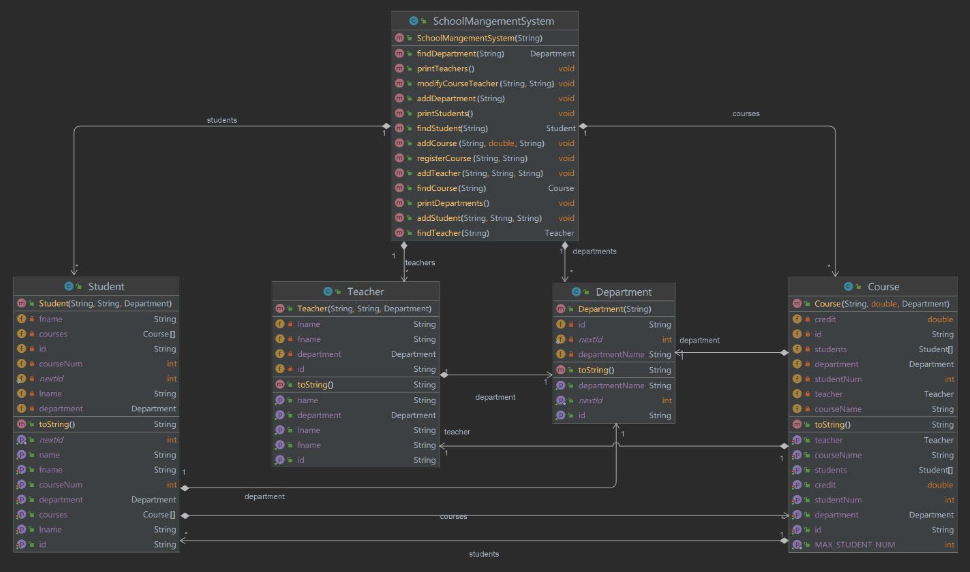

# SchoolManagementSystem
This is the final project for the first semester in java programming class taught by our one and only teacher Mr. Yi Wang.
This project is realized by Ahmet Yusuf Yildirim.

# 1. Project Description
Design and develop a SchoolManagementSystem, which should be able to support the following
functionalities:
1. School contains different departments (max 5), each department has an id, e.g.: “D001”, the id
   should be able to increase each time.
2. School contains a mount of students (max 200), each student has an id, e.g.: “S001”, the id
   should be able to increase each time. Each student can register a mount of courses (max 5),
   those courses will be stored in the field. When a student come to school, the system will store
   all its info, except the courses, which should be an empty array at the very beginning.
3. School contains a mount of teachers (max 20), each teacher has an id, e.g.: “T001”, the id should
   be able to increase each time.
4. School contains a mount of courses (max 30), each course has an id, e.g.: “C001”, the id should
   be able to increase each time. Each course is taught by one teacher and can be registered by a
   number of students (max 5). The teacher and students are not determined when a course is
   created at the very beginning.
5. The system should be able to
   a. Add a new department
   b. Add a new student
   c. Add a new teacher
   d. Add a new course
   e. Display all departments in a school, only display the department that is not null.
   f. Display all students in a school, only display the student that is not null. And only display
   the names of courses and department if there is any.
   g. Display all teachers in a school, only display the teacher that is not null. And only display
   the names of course and department if there is any.
   h. Display all courses in a school, only display the course that is not null. And only display
   the names of teacher, students, and department if there is any. (This method is missed
   in the class diagram)
   i. Search a department in the departments based on a departmentId. If the departmentId
   does not match with anything in the departments, return null.
   j. Search a teacher in the teachers based on a teacherId. If the teacherId does not match
   with anything in the teachers, return null.
   k. Search a course in the courses based on a courseId. If the courseId does not match with
   anything in the courses, return null.
   l. Search a student in the students based on a studentId. If the studentId does not match
   with anything in the students, return null.
   m. Assign a teacher to a specific course, based on teacherId and courseId, if no teacher or
   course can be found with those ids, print a message.
   n. Register a course for a student, based on studentId and courseId, which will check
   i. If the studentId or courseId does not match with anything, print a message.
   ii. If the student has register max amount courses (5), print a message.
   iii. If the course has be registered by the max number of students (5), print a
   message.
   iv. (Bonus): If the course has be registered by the student already, it cannot be
   registered again, print a message.
   v. Else add the course to the student’s registered courses array, and also add the
   student to the course’s registered students array.

# 2. Class Diagram

